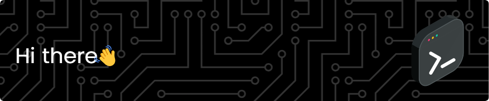

My name is João Vítor, and I'm from Brazil (🇧🇷). I've been working as Full Stack Developer since 2016. Actually I work as a Software Architect at Philips.

<!--
**jvvppereira/jvvppereira** is a ✨ _special_ ✨ repository because its `README.md` (this file) appears on your GitHub profile.

Here are some ideas to get you started:

- 🔭 I’m currently working on ...
- 🌱 I’m currently learning ...
- 👯 I’m looking to collaborate on ...
- 🤔 I’m looking for help with ...
- 💬 Ask me about ...
- 📫 How to reach me: ...
- 😄 Pronouns: ...
- ⚡ Fun fact: ...
-->

## **Languages and Tools**

  

<!--

  

 
 

-->

## **GitHub Stats** 
<!--

-->

<!--

--> 
